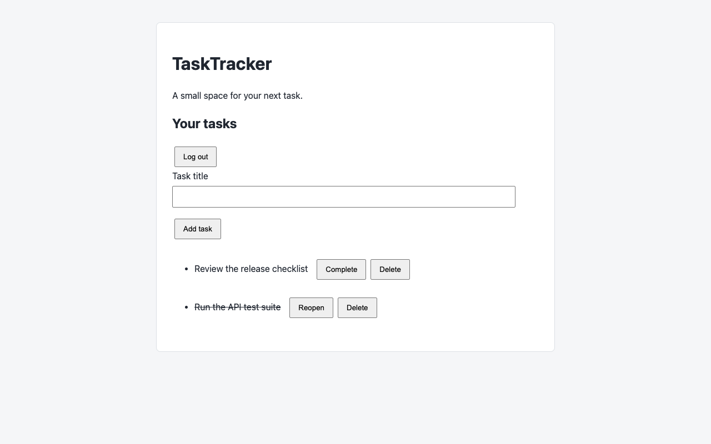

# AI-Augmented QA Test Automation Framework

A QA project built around TaskTracker, a small Express API and browser app. It covers API testing with Postman/Newman, browser workflows with Cypress, Chrome and Firefox smoke tests with Selenium, and screenshot comparison with Pixelmatch.

AI-assisted additions include edge-case tests, selector recovery rules, and optional reviews of visual differences and test failures. The test suite runs without an API key.



## Quick start

Use Node.js 24 to match CI, then run:

```sh
npm ci
npm start
```

Open **http://127.0.0.1:3000** and log in with any nonempty username and `demo-password`. You can add, complete, reopen, and delete tasks.

The app stores tasks and sessions in memory, so restarting the server clears them. The shared password is for the demo; logging in with the same username gives access to that user's tasks.

## Run tests

```sh
npm run test:all
```

The runners start their own local servers. Every suite is attempted, and any failure makes the command fail. Reports and failure drafts are written to `qa/reports/`.

The first run may download browser binaries and drivers. Visual baselines are checked in for **macOS 15 ARM64**; other platforms need their own reviewed baseline to run the visual suite. See the [visual testing guide](qa/visual/README.md).

| Command | Runs |
| --- | --- |
| `npm test` | Node tests for the API and QA tooling |
| `npm run test:api` | Baseline and edge-case Postman collections |
| `npm run test:e2e` | Cypress browser tests and selector-recovery checks |
| `npm run test:e2e:open` | Cypress in interactive mode |
| `npm run test:selenium` | Chrome and Firefox smoke tests |
| `npm run test:visual` | Screenshot comparison |
| `npm run test:suite -- postman` | One suite with failure reporting; also accepts `unit`, `cypress`, `selenium`, and `visual` |
| `npm run visual:update` | Replace the current platform's visual baselines |
| `npm run visual:review` | Review the latest screenshot differences |
| `npm run bugs:review -- postman` | Review a recorded suite failure |

## AI features

The Postman edge cases and five additional Cypress scenarios were authored with AI and checked into the repository. Selector recovery also uses checked-in rules: it can find a button after its primary selector changes, provided the scope, type, and exact text still match. These features work offline.

The two review commands can call the OpenAI Responses API to assess screenshots or redacted failure logs. They default to offline mode. To enable them, configure `.env` using [.env.example](.env.example) and the [configuration guide](docs/configuration.md). Reviews leave test results and visual baselines unchanged. Provider integration is tested with mocked responses.

## Repository layout

```text
app/                     Express API, OpenAPI contract, and browser UI
qa/unit/                 Tests for the API and QA tooling
qa/postman/              Collections and edge-case generator
qa/cypress/              Browser specs and selector rules
qa/selenium/             Cross-browser smoke runner
qa/visual/               Baselines, screenshot comparison, and review
qa/bugs/                 Failure reporting and triage
qa/reports/              Generated reports (ignored by Git)
.github/workflows/qa.yml GitHub Actions workflow
```

The [API contract](app/openapi.yaml) describes authentication and task endpoints. The same server serves the API and frontend.

GitHub Actions runs all suites on Node.js 24 and macOS 15 ARM64 for pushes, pull requests, and manual runs. Reports and screenshots are retained for 14 days. The workflow needs no AI secrets.

## Documentation

- [Testing and CI](docs/testing.md)
- [Configuration and troubleshooting](docs/configuration.md)
- [Contributing](CONTRIBUTING.md)
- [Postman edge-case brief](qa/postman/edge-cases.prompt.md)
- [Cypress test suggestions](qa/cypress/test-suggestions.md)
- [Selector recovery](qa/cypress/selector-recovery.md)
- [Visual testing and review](qa/visual/README.md)
- [Failure reports](qa/bugs/README.md)
- [Implementation checklist](TODO.md)
